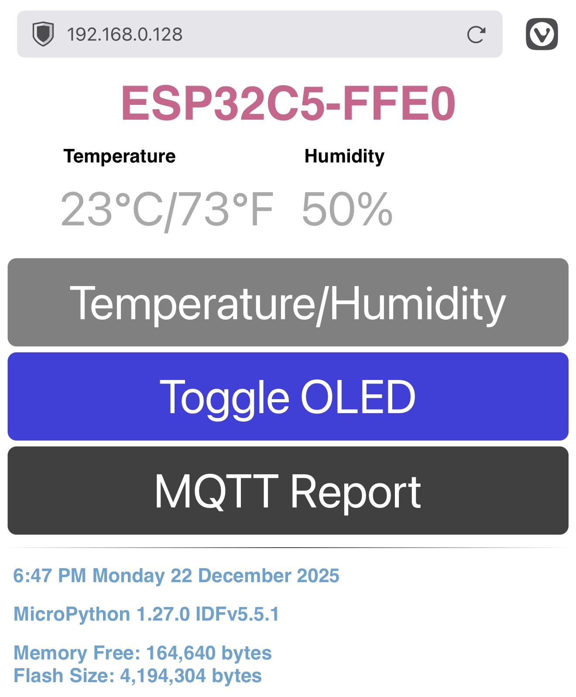

# ESP32C5-FFE8
## Main Features
This application is primarily an example of reading a DHT20 I2C temperature and humidity sensor and displaying its output on a webpage, usually via a smartphone browser. The board used is part of a DFRobots DFR1236 FireBeetle 2 ESP32-C5 Development Kit (https://www.dfrobot.com/product-2977.html) 

* The ESP32-C5 is attached, via I2C, to an OLED display and a DHT20 temperature/humidity sensor.
* The ESP32-C5 is an MQTT client and sends the DHT20 data out to a local MQTT server. This means the ESP32-C5 needs to connect to an external WiFi access point, such as a home WiFi system. That external WiFi AP then allows it to connect to an MQTT broker.
* The ESP32-C5 developer board executes the latest official release of MicroPython.

| Board                    | Part No. | MicroPython | ID/Folder Name | Key Feature |
|--------------------------|----------|-------------|----------------|-------------|
|FireBeetle 2 ESP32-C5 V1.0| DFR1236  | V 1.27.0    | ESP32C5-FFE8   | MQTT        |

| Additional Parts                            | QTY | Link |
|---------------------------------------------|-----|---------------------------------------|
|DHT20 I2C Temperature and Humidity Sensor    |  1  | https://www.adafruit.com/product/5183 |
|Monochrome 0.96" 128x64 OLED Graphic Display |  1  | https://www.adafruit.com/product/326 |

This application presents a simple webpage once it's connected to a local WiFi access point. You can access it via its assigned IP address by looking on the attached OLED display. It will be the second line of text from the bottom edge. What follows is the web page a FireBeetle 2 ESPP32-C5 board presents running this software.



The application's web page is dynamic.
1. If the Temperature/Humitidity button is tapped then the page displays the local temperature in degrees F and C, and the humidity in percentage. Continued tapping will update those values.
2. If the OLED display isn't present, then the `Toggle OLED` button is not shown.
3. If the ESP32-C5 fails to connect with the MQTT broker then the `MQTT Report` button is not shown.
4. The application gets time via NTP from the module `ntptime` in MicroPython. The default NTP server is used as defined in `ntptime`. Currently the time_tools is hard-coded for EST/EDT timezone. The file `webserver.py` instantiates `ntptime` and the file `time_tools.py` adjusts time using hard-coded EST/EDT offset.

## Startup Output
This startup output is captured from Thonny's REPL window.
```
      Boot: START
    Memory: 160,672 bytes
     Flash: 4,194,304 bytes
  Platform: MicroPython 1.27.0 riscv IDFv5.5.1 with newlib4.3.0
 Unique ID: 30EDA0FEFFE0
      SSID: ESP32C5-FFE0
 CPU Clock: 240,000,000 Hz
       I2C: SoftI2C(scl=10, sda=9, freq=500000)
       I2C: Devices found: ['0x38', '0x3d']
       I2C: SSD1306 OLED Initialized
       I2C: DHT20 Initialized
      Boot: END
      Main: START
      Main: END
      WIFI: Connected
      WIFI: 192.168.0.128
      WIFI: NTP Connection Attempt #1
      WIFI: NTP Connection Successful
      DATE: 9:14 PM  Monday 22 December 2025
      MQTT: Broker connection start from ESP32C5-FFE0 to 192.168.0.167
      MQTT: Set receive topic callback
      MQTT: Connect Attempt
      MQTT: Subscribe to topic esp32/status
      MQTT: Init ping timer: Timer(1, mode=PERIODIC, period=1000)
      MQTT: Broker connection successfull to 192.168.0.167
```
If the board fails to connect to the MQTT broker, this is the last part of the output:
```
...
      MQTT: Broker connection start from ESP32C5-FFE8 to 192.168.0.167
      MQTT: Set callback
      MQTT: Connect
      MQTT: Broker connection failure to 192.168.0.167
      MQTT: Exception: [Errno 113] ECONNABORTED
```
## Development Environment
### Initial Setup
The following items and actions are required:
1. A home WiFi access point
2. An operational computer connected to the home WiFi access point
3. Eclipse Mosquitto MQTT Broker (https://mosquitto.org) installed on a computer
4. An ESP32-C5 developer board with the latest MicroPython release flashed to the device
5. All the MicroPython files copied to the ESP32-C5 developer board
### Application Software/Firmware Installation and Execution
#### MicroPython Firmware and Application
Install the latest MicroPython release to the ESP32-C5 development board. At the time of writing this is version 1.27.0, released on 9 December 2025. It can be found at [ESP32_GENERIC_C5](https://micropython.org/download/ESP32_GENERIC_C5/). Select the `.bin` version of the firmware. The MicroPython download page provides full installation instructions.

Once the firmware is operational on the ESP32-C5 developer board, then upload all the Python files, and only the Python files, to the developer board.

In order to attach to your local WiFi access point, you will need to create a `settings.py` file that contains the following two lines:
1. `AP_SSID = "your-wifi-SSID"` and
2. `AP_PASSWORD = "your-wifi-password"`

with the appropriate SSID and password for your local WiFi access point. These are used by the file `webserver.py`. Once created flash `settings.py` onto the ESP32-C5 developer board with the rest of the MicroPython files.
### Setting Up Your MQTT Host Computer
#### Mosquitto
Any computer will do. For this example I am using my computer that's running Linux Mint 22.2. Within that environment:

Install Mosquitto via `apt`:
```bash
sudo apt install mosquitto mosquitto-clients -y
```
Once installed, add the following lines (at a minimum) to `/etc/mosquitto/conf.d/default.conf`:
```
allow_anonymous true
listener 1883 0.0.0.0
```
After adding that text to `default.conf` run `sudo systemctl stop mosquitto` then `sudo systemctl start mosquitto`,
then check if the Mosquitto broker is up and running:
```bash
$ systemctl status mosquitto
● mosquitto.service - Mosquitto MQTT Broker
     Loaded: loaded (/usr/lib/systemd/system/mosquitto.service; enabled; preset: enabled)
     Active: active (running) since Tue 2025-06-10 22:01:46 EDT; 4 days ago
 Invocation: 809467da2f104de387c6a49227c287b8
       Docs: man:mosquitto.conf(5)
             man:mosquitto(8)
   Main PID: 18660 (mosquitto)
      Tasks: 1 (limit: 9354)
        CPU: 1min 5.536s
     CGroup: /system.slice/mosquitto.service
             └─18660 /usr/sbin/mosquitto -c /etc/mosquitto/mosquitto.conf

Jun 10 22:01:46 pi05-01 systemd[1]: Starting mosquitto.service - Mosquitto MQTT Broker...
Jun 10 22:01:46 pi05-01 mosquitto[18660]: 1749607306: Loading config file /etc/mosquitto/conf.d/default.conf
Jun 10 22:01:46 pi05-01 systemd[1]: Started mosquitto.service - Mosquitto MQTT Broker.
Jun 14 00:50:10 pi05-01 systemd[1]: Reloading mosquitto.service - Mosquitto MQTT Broker...
Jun 14 00:50:10 pi05-01 systemd[1]: Reloaded mosquitto.service - Mosquitto MQTT Broker.
```
The second status line should show `Loading config file /etc/mosquitto/conf.d/default.conf`. If it doesn't then your MQTT client won't connect.
#### Host Setup
Once the broker is up, open a terminal and type the following:
```bash
mosquitto_sub -i "esp32_mqtt5_tester" -t "esp32/status" -c &
```
Leave the terminal up. The `-i` switch is the subscriber identifier, and the `-t` switch is the topic, which must match the topic in the ESP32-C5 MicroPython code module `mqtt_tools.py`.

The application on the ESP32-C5 connects to the broker via the Mosquitto subscriber using topic `esp32/status`. Messages are sent from the ESP32-C5 in minified JSON and are echoed to the terminal.
#### Development Board Setup
The file `mqtt_tools.py` contains the following variables at the top of the source file:
```python
MQTT_BROKER    = "192.168.0.167"
ESP32_TOPIC    = b"esp32/status"
```
The `MQTT_BROKER` variable is the IP address of the MQTT host. You need to change this to match your environment. The variable `ESP32_TOPIC` can be changed to suit if you remember to make sure to match it with the host topic, else communications between client and host will not work.
#### Typical Outputs
All ESP32-C5 minified JSON messages:
```
{"PWRON":"ESP32C5-FFE0","TEMP":"23C","HUMIDITY":"50%","DATE":"2025-12-23T11:41:14.001Z"}

{"REPORT":"ESP32C5-FFE0","TEMP":"23C","HUMIDITY":"50%","OLED":"Enabled","VERSION":"MicroPython 1.27.0","COMPILER":"IDFv5.5.1","BUILD_DATE":"2025-12-09","DATE":"2025-12-23T11:42:09.001Z"}

{"PING":"ESP32C5-FFE0","TEMP":"23C","HUMIDITY":"50%","DATE":"2025-12-23T11:44:09.001Z"}
```
The `PWRON` message is sent every time the board successfully starts up and immediately after opening a connection to the MQTT broker.

The `PING` message is sent every 120 seconds/two minutes, if no other message has been sent. If a message is sent within that two minute windows then the down counter associated with the ping function is reset. A ping message is therefore sent every two minutes _if no other message is sent within that window_,

The `REPORT` message is sent via the `MQTT Report` web page button. It sends out the temperature (`TEMP`), humidity (`HUMIDITY`), if the OLED (`OLED`) display was found and enabled (None if it was not), MicroPython version, the version of the ESP-IDF toolset that was used to build that MicroPython version and the date MicroPython was last built.

Every message starts with the SSID that sent the message.

Every message ends with the time stamp in ISO 8601 UTC format.

## Changes and Updates
#### _December 2025_
General cleanup and preparation for further development.

## License

    Copyright 2025, 2026 William H. Beebe, Jr.

    Licensed under the Apache License, Version 2.0 (the "License");
    you may not use this file except in compliance with the License.
    You may obtain a copy of the License at

    http://www.apache.org/licenses/LICENSE-2.0

    Unless required by applicable law or agreed to in writing, software
    distributed under the License is distributed on an "AS IS" BASIS,
    WITHOUT WARRANTIES OR CONDITIONS OF ANY KIND, either express or implied.
    See the License for the specific language governing permissions and
    limitations under the License.
