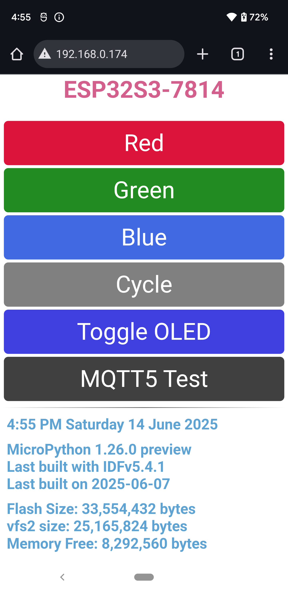

# ESP32S3-7814
## Major Changes

The ESP32-S3 developer board still executes MicroPython, in this case the latest pre-release.

| Board                    | Version | ID           | Folder Name   | Feature | AD  |
|--------------------------|---------|--------------|---------------|---------|-----|
|ESP32-S3-DevKitC-1.1-N32R8| 1.26.0P | ESP32S3-7814 | ESP32S3-7814  | MQTT    | Yes |

ESP32S3-7814 is no longer a stand-alone WiFi access point. Because of the addition of MQTT functionality, it now needs to connect to an external WiFi access point, such as a home WiFi system. That external WiFi AP then allows it to connect to an MQTT broker.

This is the web page a fully functioning ESP32-S3 developer board presents now.



The view the web page presents is dynamic. Here's what that means:
1. If the OLED display isn't present, then the `Toggle OLED` button is not shown.
2. If the ESP32-S3 fails to connect with the MQTT broker then the `MQTT5 Test` button is not shown.
3. If the ESP32-S3 developer board does not have a configured `vfs2` FLASH section, then the text at the bottom showing `vfs2 size` is not shown.

## Startup Output
This startup output is captured from Thonny's REPL window.
```
      Boot: START
    Memory: 8,297,184 bytes
     Flash: 33,554,432 bytes
  Platform: MicroPython 1.26.0 preview xtensa IDFv5.4.1 with newlib4.3.0
 Unique ID: 68B6B33D7814
      SSID: ESP32S3-7814
 CPU Clock: 160,000,000 Hz
       I2C: SoftI2C(scl=2, sda=1, freq=500000)
       I2C: Devices found: ['0x3d']
       I2C: SSD1306 OLED Found
      Boot: END
      Main: START
       LED: COLORS
 7 SEG LED: TESTS
  JOYSTICK: ENABLE
      Main: END
      WIFI: Connected
      WIFI: 192.168.0.174
      WIFI: NTP Connection Attempt #1
      WIFI: NTP Connection Successful
      DATE: 8:28 AM  Friday 27 June 2025
      MQTT: Broker connection start from ESP32S3-7814 to 192.168.0.210
      MQTT: Set callback
      MQTT: Connect
      MQTT: Subscribe to topic b'esp32-mqtt5/test'
      MQTT: Init ping timer: Timer(3, mode=PERIODIC, period=60000)
      MQTT: Broker connection successful to 192.168.0.210

```
If the board fails to connect to the MQTT broker, this is the last part of the output:
```
...
      MQTT: Broker connection start from ESP32S3-7814 to 192.168.0.210
      MQTT: Set callback
      MQTT: Connect
      MQTT: Broker connection failure to 192.168.0.210
      MQTT: Exception: [Errno 113] ECONNABORTED
```
## Development Environment
### Initial Setup
The following items and actions are required:
1. A home WiFi access point
2. An operational computer connected to the home WiFi access point
3. Eclipse Mosquitto MQTT Broker (https://mosquitto.org) installed on the computer
4. An ESP32-S3 developer board with the latest MicroPython release flashed to the device
5. All the MicroPython files copied to the ESP32-S3 developer board
### Application Software/Firmware Installation and Execution
#### MicroPython Firmware and Application
Install the latest MicroPython release to the ESP32-S3 development board. It can be found at [ESP32_GENERIC_S3](https://micropython.org/download/ESP32_GENERIC_S3/). Make sure to select from the _**Firmware (Support for Octal-SPIRAM)**_ section at the bottom if you have a development board with 8 MiB of SPIRAM. Select the `.bin`, not the `.uf2` version of the firmware. The download page provides full installation instructions.

Once the firmware is operational on the ESP32-S3 developer board, then upload all the Python files, and only the Python files, to the developer board.

You will need to create `settings.py` file that contains the two lines:
1. `AP_SSID = "your-wifi-SSID"` and
2. `AP_PASSWORD = "your-wifi-password"`,

with the appropriate SSID and password for your local WiFi access point. These are used by the file `webserver.py`. Once created flash onto the ESP32-S3 developer board with the rest of the MicroPython files.

#### Mosquitto
My operational personal computer is a Raspberry Pi 5 8 GiB with Ubuntu 25.04 installed and configured as a personal computer. With that environment:

Install Mosquitto via `apt`:
```bash
$ sudo apt install mosquitto mosquitto-clients -y
```
Once installed make sure that the Mosquitto broker is up and running:
```bash
$ systemctl status mosquitto
● mosquitto.service - Mosquitto MQTT Broker
     Loaded: loaded (/usr/lib/systemd/system/mosquitto.service; enabled; preset: enabled)
     Active: active (running) since Tue 2025-06-10 22:01:46 EDT; 4 days ago
 Invocation: 809467da2f104de387c6a49227c287b8
       Docs: man:mosquitto.conf(5)
             man:mosquitto(8)
   Main PID: 18660 (mosquitto)
      Tasks: 1 (limit: 9354)
        CPU: 1min 5.536s
     CGroup: /system.slice/mosquitto.service
             └─18660 /usr/sbin/mosquitto -c /etc/mosquitto/mosquitto.conf

Jun 10 22:01:46 pi05-01 systemd[1]: Starting mosquitto.service - Mosquitto MQTT Broker...
Jun 10 22:01:46 pi05-01 mosquitto[18660]: 1749607306: Loading config file /etc/mosquitto/conf.d/default.conf
Jun 10 22:01:46 pi05-01 systemd[1]: Started mosquitto.service - Mosquitto MQTT Broker.
Jun 14 00:50:10 pi05-01 systemd[1]: Reloading mosquitto.service - Mosquitto MQTT Broker...
Jun 14 00:50:10 pi05-01 systemd[1]: Reloaded mosquitto.service - Mosquitto MQTT Broker.
```
In the example above Mosquitto is loaded and active (running). If it's not, then type `sudo systemctl start mosquitto` at the prompt and check the status again.
#### Development and Testing
Once the broker is up, open a terminal and type the following:
```bash
$ mosquitto_sub -i "esp32_mqtt5_tester" -t "esp32-mqtt5/test" -c &
```
Leave the terminal up. The `-i` switch is the subscriber identifier, and the `-t` switch is the topic, which must match the topic in the ESP32-S3 MicroPython code module `mqtt_tools.py`.

The application on the ESP32-S3 connects to the broker via the Mosquitto subscriber using topic `esp32-mqtt5/test`. Messages are sent from the ESP32-S3 in minified JSON and are echoed to the terminal.

All ESP32-S3 minified JSON messages:
```
 {"PWRON":"ESP32S3-7814","DATE":2025-06-27T20:22:53.004Z"}
 {"PING":"ESP32S3-7814","DATE":2025-06-27T20:23:53.004Z"}
 {"LED":"ESP32S3-7814","COLOR":"RED","STATE":"ON","DATE":2025-06-27T20:24:01.004Z}"
 {"LED":"ESP32S3-7814","COLOR":"RED","STATE":"OFF","DATE":2025-06-27T20:24:06.004Z"}
 {"LED":"ESP32S3-7814","COLOR":"GREEN","STATE":"ON","DATE":2025-06-27T20:24:08.004Z"}
 {"LED":"ESP32S3-7814","COLOR":"GREEN","STATE":"OFF","DATE":2025-06-27T20:24:10.004Z"}
 {"LED":"ESP32S3-7814","COLOR":"BLUE","STATE":"ON","DATE":2025-06-27T20:24:12.004Z"}
 {"LED":"ESP32S3-7814","COLOR":"BLUE","STATE":"OFF","DATE":2025-06-27T20:24:14.004Z"}
 {"TEST":"ESP32S3-7814","VERSION":"MicroPython 1.26.0 preview","COMPILER":"IDFv5.4.1","BUILD_DATE":"2025-06-26","DATE":2025-06-27T20:24:17.004Z"}

```
The `PWRON` message is sent every time the board successfully starts up and immediately after opening a connection to the MQTT broker.

The `PING` message is sent every 60 seconds.

The `LED` messages are generated from the web page buttons toggling the color LED. They tell which LED color is chosen and if the LED is on or off.

The `TEST` message is sent via the `MQTT5 Test` web page button. It sends the MicroPython version, the version of the ESP-IDF toolset that was used to build that MicroPython version and the date it was last built.

Every message contains the SSID that sent the message.

Every message time stamp is in ISO 8601 format, UTC.

## Changes and Updates
#### _26 June 2025_

After re-reading a specific MicroPython check-in, I re-ran `idf.py fullclean`, then `idf.py set-target esp32s3 menuconfig` to set the maximum amount of flash to 32 GiB. The latest checkins fixed the bug with the ESP32-S3 boards with more than 8 GiB of FLASH; those boards will now report the correct amount of FLASH.

After a successful MicroPython build I completely erased an ESP32-S3-DevKitC-1.1-N32R8 development board with `esptool.py --port /dev/ttyUSB0 erase_flash` (where the board is attached via USB to `/dev/ttyUSB0`) and then reprogrammed it with the latest MicroPython firmware built from the latest sources. I then uploaded all the Python code back onto the board. The code executed as expected. The problem was on my end. I'm now back to using the latest preview MicroPython.

#### _16 June 2025_

A checkin to the main MicroPython project has broken the build. I can't use that build on my ESP32-S3 developer board, so I've dropped back to the official 1.25.0 release. That is sufficient for my work, and what I'll stick with indefinately. This README has been updated to reflect this.
