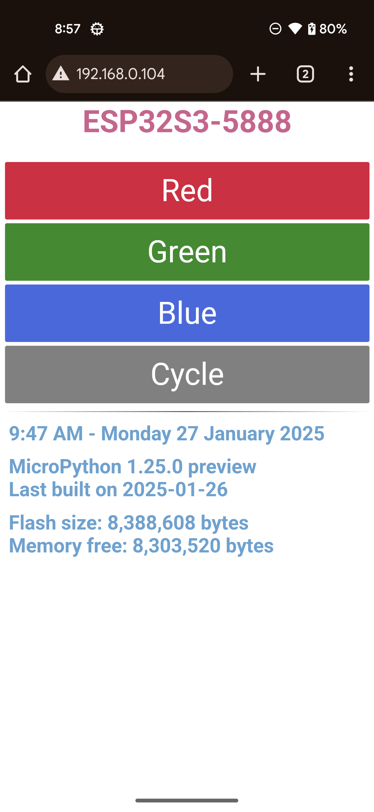

# Espressif MicroPython Projects

### Naming Nomenclature

All of my devices use a naming nomencature that is synthesized from the board's
system name and the last four digits of the board's unique ID. The following code
works for regular MicroPython.
```python
import binascii
import machine as ma
import os
UNAME = os.uname().sysname.upper()
UNIQUE_ID = binascii.hexlify(ma.unique_id()).decode('ascii').upper()
SSID = UNAME + '-' + UNIQUE_ID[-4:]
```
I call the final result _SSID_ because a number of the Espressif boards are
programmed to act as stand-alone WiFi access points. Whether the SSID is used
for that or not, it makes for a unique identifier for all the boards.

Because of micro:bit MicroPython does not have the binascii package, the following
code is used to determine the naming nomenclature.
```python
import machine as ma
import os
UNAME = os.uname().sysname.upper()
UNIQUE_ID = ''.join("{:02X}".format(b) for b in ma.unique_id())
SSID = UNAME + "-" + UNIQUE_ID[-4:]
```
A list comprehension is used to properly format the binary machine.unique_id() into text.

### WARNING

There's a lot of duplicated code across all the devices. It all works, but
there are some devices with more 'correct' code than others.

## Espressif Device Listing

### These folders under Espressif

| Board                    | Version | ID           | Folder Name   | Feature | AD  |
|--------------------------|---------|--------------|---------------|---------|-----|
|ESP32-S3-DevKitC-1.1-N32R8| 1.24.0  | ESP32S3-287C | ESP32S3-287C  | WiFi AP |     |
|ESP32-S3-DevKitC-1.1-N32R8| 1.25.0P | ESP32S3-287C | ESP32S3-287C-2| WiFi    |     |
|ESP32-S3-DevKitC-1.1-N8R8 | 1.24.0  | ESP32S3-4EF0 | ESP32S3-4EF0  | WiFi AP |     |
|ESP32-S3-DevKitC-1.1-N8R8 | 1.24.0  | ESP32S3-4EF0 | ESP32S3-4EF0-2| WiFi AP |     |
|ESP32-S3-DevKitC-1.1-N8R8 | 1.24.0  | ESP32S3-5554 | ESP32S3-5554  | WiFi AP |     |
|ESP32-S3-DevKitC-1.1-N8R8 | 1.24.0  | ESP32S3-5554 | ESP32S3-5554-2| WiFi AP |     |
|ESP32-S3-DevKitC-1.1-N8R8 | 1.24.0  | ESP32S3-5F50 | ESP32S3-5F50  | WiFi AP |     |
|ESP32-S3-DevKitC-1.1-N8R8 | 1.24.0  | ESP32S3-5F50 | ESP32S3-5F50-2| WiFi AP |     |
|ESP32-S3-DevKitC-1.1-N32R8| 1.25.0P | ESP32S3-5888 | ESP32S3-5888  | WiFi    |     |
|ESP32-S3-DevKitC-1.1-N32R8| 1.25.0P | ESP32S3-7814 | ESP32S3-7814  | WiFi AP | Yes |
|ESP32-S3-DevKitC-1.1-N8R8 | 1.24.0  | ESP32S3-C534 | ESP32S3-C534  | MAX7219 |     |
|ESP32-S3-DevKitC-1.1-N32R8| 1.25.0P | ESP32S3-E138 | ESP32S3-E138  | WiFi    |     |
|ESP32-S3-DevKitC-1.1-N32R8| 1.25.0P | ESP32S3-E1D0 | ESP32S3-E1D0  | WiFi    |     |
|ESP32-S3-DevKitC-1.1-N32R8| 1.25.0P | ESP32S3-F838 | ESP32S3-F838  | WiFi    |     |

_The Version column is the MicroPython version in use. The letter P next to a version
stands for Preview._

_The AD column means under active development at the moment._

## Example Connecting to a Local WiFi Access Point

This is an example webpage produced by the code in all the devices with Feature Wifi (not Feature WiFi AP!).

The code is compact enough to allow you to work with the device's RGB LED. As a further test of the device's WiFi capabilities the code will reach out and set the time from an NTP service on the web.

I use Thonny (version 4.1.7, (https://thonny.org)) to work with my devices. The module `settings.py` will need to be modified with the SSID and password for you local WiFi access point. Once those are correctly entered and the device is restarted, you should see something very similar to the following output:
```
MPY: soft reboot
 MicroPython 1.25.0 preview xtensa IDFv5.4 with newlib4.3.0
 Flash size 8,388,608 bytes
 Memory free 8,318,832 bytes
 ESP32S3-5888
 WIFI connected
 WIFI: NTP Successful
  NTP: 1:11 PM - Tuesday 28 January 2025
 192.168.0.104
```

The IP address at the bottom of the output window is the IP address you use to connect to the device. I use a Pixel 4a for my testing with the default Google browser. What follows is a typical output. The buttons are basically toogles. For example touch the Red button and the RGB LED turns red. Touch it again, and the RGB LED turns off. The Cycle button cycles six colors on the RGB LED, and then turns off.



## Changes and Updates
#### _28 JANUARY 2025_
The development version of Micropython version 1.25 prerelease has now switched to using ESP-IDF version 5.4 to compile for Espressif devices. As a consequence, as I pull out my various boards I'm updating everything to Micropython version 1.25 prerelease that I build locally. I'll step up to the full release when it's made available. There are important reasons for stepping up to ESP-IDF 5.4, many having to do with how all the radios are managed.

[Espressif IoT Development Framework](https://github.com/espressif/esp-idf)


    Copyright 2024 William H. Beebe, Jr.

    Licensed under the Apache License, Version 2.0 (the "License");
    you may not use this file except in compliance with the License.
    You may obtain a copy of the License at

    http://www.apache.org/licenses/LICENSE-2.0

    Unless required by applicable law or agreed to in writing, software
    distributed under the License is distributed on an "AS IS" BASIS,
    WITHOUT WARRANTIES OR CONDITIONS OF ANY KIND, either express or implied.
    See the License for the specific language governing permissions and
    limitations under the License.
