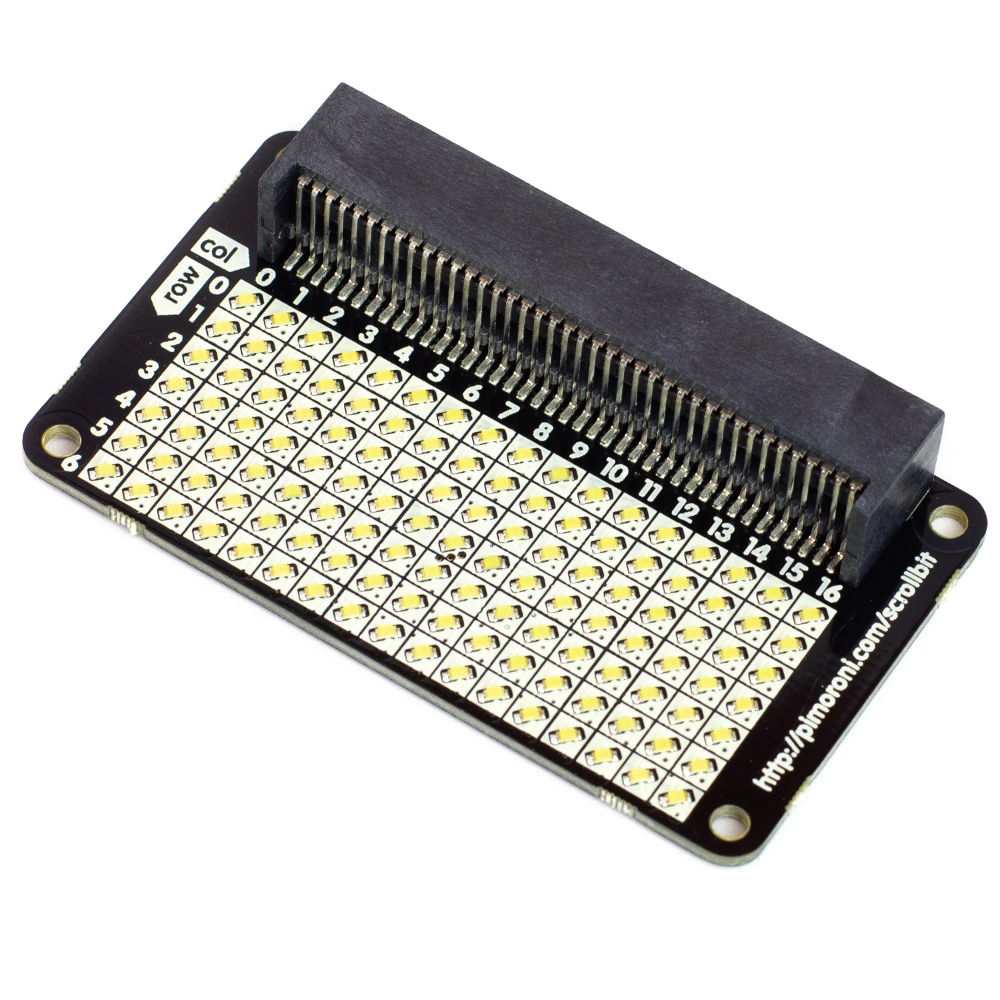

# MicroPython Projects

## micro:bit

These are for the version 1 and version 2 micro:bit BBC devices.
There is a PartsDocumentation folder at this level that contains
the [IS31FL3731 component data sheet](/PartsDocumentation/IS31FL3731_DS.pdf),
the same part used by the
Pimoroni Scrollbit for the micro:bit, which Pimoroni no longer
makes. The IS31FL3731 data sheet is provided for the possible
creation of a replacement board.

 
[Pimoroni Scrollbit](https://shop.pimoroni.com/products/scroll-bit)

Look in the subfolder **01-Images** for the code that uses the Pimoroni Scrollbit.

## micro:bit Device Listing

| Board               | Version | ID / Folder Name | Feature  | AD  |
|---------------------|---------|------------------|----------|-----|
| micro:bit v1.0.1    | v1.9.2  | MICROBIT-5906    | nRF51822 |     |
| micro:bit v2.0.0    | v1.15   | MICROBIT-784D    | nRF52833 | Yes |

_The Version column is the MicroPython version in use. The letter P next to a version
stands for Preview._

_The AD column means under active development at the moment._